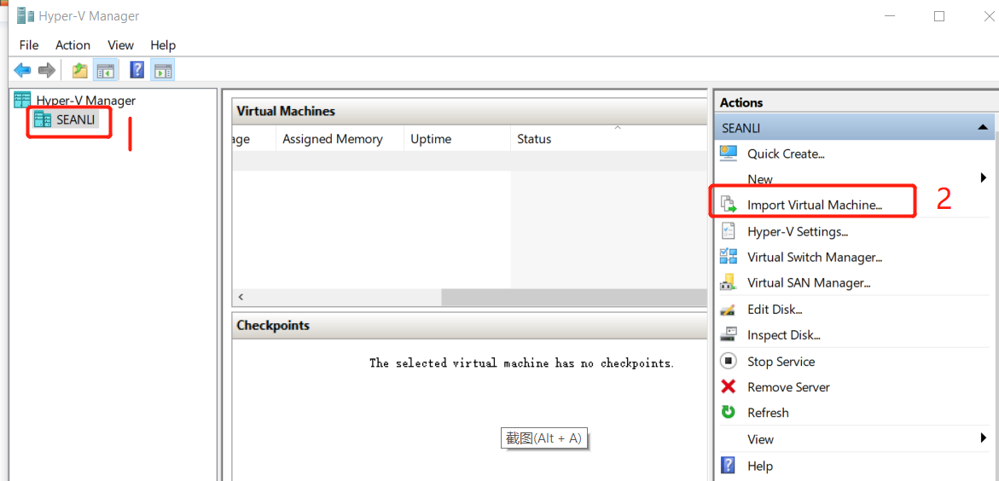
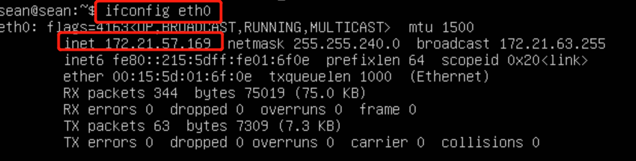

## 使用试用 VM

### 使用Windows Hyper-V 

#### 下载VM, 并解压VM

下载地址: https://img.graphxr.cn/graphxr/GraphXR_Try_vm.zip


#### 在windows 搜索并打开（Hyper-V Manager）, 让后导入VM
> windows机器剩余内存推荐不低于10GB



#### 连接VM后登录, 并查看IP地址 （示例中ip 为 172.21.57.169）

```
默认账号/密码:graphxr/tuke
```

```
ifconfig eth0 
```


#### 访问GraphXR(http://172.21.57.169:9000)

```
 访问地址：http://172.21.57.169:9000
 GraphXR 端口：9000 
 默认账号/密码: admin@graphxr.cn/tuke
```

#### 访问Neo4j (http://172.21.57.169:7474)

```
访问地址: http://172.21.57.169:7474
Bolt 端口：7687
Http 端口：7474
Host 地址： neo4j  (配置GraphXR项目，可以使用IP 172.21.57.169 或者 neo4j )
默认账号/密码:  neo4j/tuke
```